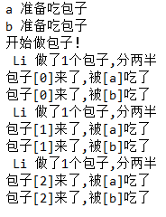

# 装饰器

**定义**：本质是函数，装饰其他函数(为其他函数添加附加功能)

**原则**：

1. 不能修改被装饰的函数的源代码
2. 不能修改被装饰的函数的调用方式


## 实现装饰器知识储备

- 函数即“变量”

- 高阶函数
    1. 把一个函数名当作实参传给另一个函数
    
    2. 返回值中包含函数名
    
- 嵌套函数

即**高阶函数+嵌套函数=>装饰器**


## 示例代码
```python
import time

def timmer(func):
    def warpper(*args,**kwargs):
        start_time=time.time()
        func()
        stop_time=time.time()
        print('the func time is %s' % (stop_time-start_time))
    return warpper

@timmer
def test1():
    time.sleep(3)
    print('in the test1')

test1()
```
相当于:
```python
test1 = timmer(test1)
test1()
```
## 装饰器的高阶应用
```python
user,passwd = 'sd','sd'
def auth(auth_type):
    #利用传参来区分口令验证方式的使用
    print('auth_type:',auth_type)#local和ldap都已传入
    def out_wrapper(func):
        #增加一层函数来传入实参函数并返回函数结果
        def wrapper(*args,**kwargs):
            print('wrapper out args:',*args,**kwargs)
            #传入func的参数，这里home()和bbs()都没有参数
            if auth_type == 'local':
                username = input('username:').strip()
                password = input('password:').strip()

                if user == username and passwd == password:
                    print('user has passed authentication ')
                    func(*args,**kwargs)
                    #运行func函数
                else:
                    exit('invalid username or password')

            elif auth_type == 'ldap':
                print('不支持ldap')
        return wrapper
    return out_wrapper
    
def index():
    print ('welcome to index page')

@auth(auth_type='local')#在装饰器加上参数即可
def home1():
    print('welcome to home page')

@auth(auth_type='ldap')
def bbs():
    print('welcome to bbs page')

index()
home1()
bbs()
```

---

# 生成器
## 什么是列表生成式
```python
#列表生成式
a = [i*2 for i in range(10)]
#[func(i) for i in range(10)]
#相当于
b = []
for i in range(10):
     b.append(i*2)
print(a,b)
```
a和b的结果都是\[0,2,4,6,8,10,12,14,16,18\]。

## 什么是生成器
生成器,给出一个指定的地址，当调用时才会生成相应的数据;
而列表生成式是直接创建一整个列表，不管需不需要使用到。
```python
a = [i*2 for i in range(100000000)]#列表
b = (i*2 for i in range(100000000))#生成器
```
当调用`print(b[1000])`是会发生错误，因为必须循环到1000才会有b\[1000\]。
### 调用生成器的唯一方法
`__next__()`是调用生成器的唯一方法（在python2.7中是`next()`），不过基本不会调用该方法，因为一般会使用循环迭代的方式获取（循环本质是一次次的调用`__next__()`）。
```python
print(b.__next__())
#唯一方法__next__().python2.7中是next();不过基本不会调用该方法，一般使用循环迭代
print(b.__next__())
print(b.__next__())
#循环迭代
for i in b:
     print(i)
```
执行以上代码后获得的是0,2,4...，**注意__next__()之后不能回到上一个元素，之前的元素不保留，只停留在当前位置。**

### 斐波拉契数列和yield的使用
**斐波拉契数列，除第一个和第二个数外，任意一个数都可以由前两个数相加得到。比如:1,1,2,3,5,8,13,21,34**
```python
def fib(max):
    n,a,b = 0,0,1
    while n < max:
        print(b)
        a,b = b,a+b
        # 相当于
        # t=(b,a+b) ,t是元组
        # a=t[0]
        # b=t[1]
        n=n+1
f = fib(10)
```
执行以上代码可以得到一个斐波拉契数列（列表），当`print(b)`替换成`yield b`后，该列表就变成一个生成器了。

### 生成器的应用——协程
现在我们来使用生成器来实现单线程下的并行效果，代码如下：

```python
import time

def consumer(name):
    print('%s 准备吃包子' % name)
    while True:
        baozi = yield
        print('包子[%s]来了,被[%s]吃了' % (baozi,name))

def producer(name):
    # 初始化
    c = consumer('a')
    c2 = consumer('b')
    #生成一个生成器,本身不print第一句话
    c.__next__()
    c2.__next__()
    #使生成器从头往下走，print第一句话
    print('开始做包子！')
    for i in range(10):
        time.sleep(1)
        print(' %s 做了1个包子,分两半' % name)
        c.send(i)# send()唤醒生成器并可以给yield传值
        c2.send(i)

producer('Li')
```
输出结果：


---

# 迭代器

## 什么是迭代对象
> 我们已经知道，可以直接作用于for循环的数据类型有以下几种:
一类是集合数据类型，如list,tuple,dict,set,str等;
一类是generator，包括生成器和带yield的generator function。
这些可以直接作用于for循环的对象统称为可迭代(可循环)对象：Iterable。
可以使用isinstance()判断一个对象是否为Iterable对象。

- isinstance()的使用
```python 
from collections import Iterable
a= isinstance([],Iterable)
b= isinstance({},Iterable)
c= isinstance(100,Iterable)
d= isinstance('sad',Iterable)
e= isinstance((x for x in range(10)),Iterable)

print(a,b,c,d,e)
```
输出结果:
> True True False True True

## 什么是迭代器
> 可以被next()函数调用并不断返回下一个值的对象称为迭代器:Inerator。生成器肯定是迭代器。

- isinstance()的使用
```python
from collections import Iterator
a= isinstance([],Iterator)
b= isinstance({},Iterator)
c= isinstance(100,Iterator)
d= isinstance('sad',Iterator)
e= isinstance((x for x in range(10)),Iterator)

print(a,b,c,d,e)

# list,tuple,dict,set,str虽然是Iterable对象，但不是Inerator，
# 要变成迭代器可以使用iter()函数
a= isinstance(iter([]),Iterator)
print(a)
```
输出结果:
> False False False False True
> True

## 为什么list,tuple,dict,set,str不是Inerator（迭代器）
答:
> 因为python的迭代器对象表示是一个数据流，
可被next()函数调用并不断返回下一个数据,
直到没有数据时抛出StopIteration错误。
该数据流是一个有序序列，但我们不知道序列的长度，
只能不断通过next()函数实现按需计算下一个数据，
所以Iterator的计算是惰性的，只有在需要返回下一个数据时才会计算。
Iterator甚至可以表示一个无限大的数据流，例如全体自然数，而使用list是永远不可能存储全体自然数的。

** 在3.xpython中range(x)是一个迭代器(for循环其实就是通过next()来获取下一个数据)，2.7中则是直接生成一个固定长度列表 **

---

# Json的序列化和反序列化
**介绍：json基本所有语言都适用，作用主要用于不同语言之间进行数据交互(以前是xml),而json序列化就是把json字典变成字符串形式。**
代码：
```python
info = {
    'name': 'yyp',
    'age': 22
}

#方法1
#json序列化
f = open('text.text', 'w')
f.write(str(info))
f.close()
#json反序列化
f = open('text.text','r')
data = eval(f.read())#eval:执行括号中字符串语句并输出
f.close()
print(data['age'])


#方法2
import json#处理简单的json序列化，无法处理函数
import pickle#处理复杂的,与json用法完全一样,且只能在python环境下使用

def send (name):
    print('hello',name)

info = {
    'name':'yyp',
    'age':22,
    'func':send#传入内存地址(伴随程序结束而消失),因为是bytes，所以open要用二进制模式b
}
#json序列化
f = open('text1.text','wb')
#f.write(json.dumps(info))
f.write(pickle.dumps(info))
#也可以用pickle.dump(info,f)
f.close()
#反序列化
f = open('text1.text','rb')
#data = json.loads(f.read())
data = pickle.loads(f.read())
#也可以用data = pickle.load(f)
print(data['age'])
#反序列化时函数名一样的情况下内容可以不相同,也就是说虽然传入的是内存地址，但是其实序列化的是整个函数本身,因为两个程序的内存不可能互相访问的
print(data['func']('yyp'))
```
注：在使用json和pickle方法时，单个文件只dump一次load一次，如果需要存多个状态就存放多个文件，不然会出错。
