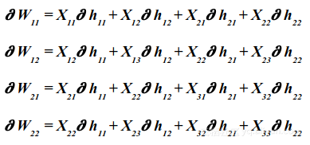

# 基于卷积神经网络的人脸识别

## 卷积神经网络的发展史
- 我们知道，神经网络这一概念最早是生物界提出的，而人工智能界的神经网络很大程度上是在模拟人类的神经元。影响到CNN起源的相关研究是有关视觉皮层的，其中较著名的是Hubel 和Wiesel1968年做出的工作。在这项研究中有许多概念都与现在的人工神经网络相呼应，比如多层级结构、过滤信息、本地连接和平移不变性等；
- 后来，在1980年一位日本科学家提出了neocognitron，其目标是构建一个能够像人脑一样实现模式识别的网络结构从而帮助我们理解大脑的运作，创造性地从人类视觉系统引入了许多新的思想到人工神经网络，被许多人认为是CNN的雏形；
- 十年后，LeCun将反向传播应用到了类似Neocoginitro的网络上来做有监督学习，CNN开始逐渐走向各个应用领域；
- 1992年，美籍华裔科学家翁巨杨提出了两个广泛应用至今的trick，数据增强和最大池化，进一步提高了算法的鲁棒性，改变了千篇一律的用平均池化做downsampling的状况；
- 到了1998年，LeCun提出了LeNet-5，该结构与我们现在看到的CNN已经别无二致这里网络层数加深到了7层，其中两层卷积两层池化。至此，CNN发展史上的大部分问题都得以解决，但由于计算能力限制和SVM的大放异彩，CNN沉寂了十年；直到2012年的AlexNet出现神经网络才真正开始复苏和崛起。
-------------
## 卷积神经网络的架构
### 前向传播

#### 1.输入层
输入层主要是n×m×3 RGB图像，这不同于人工神经网络，人工神经网络的输入是n×1维的矢量。

#### 2.卷积层
在卷积层中，计算输入图像的区域和滤波器的权重矩阵之间的点积，并将其结果作为该层的输出。滤波器将滑过整个图像，重复相同的点积运算。

1.滤波器必须具有与输入图像相同数量的通道；
    
2.网络越深，使用的滤波器就越多；拥有的滤波器越多，获得的边缘和特征检测就越多。

#### 3.池化层

池化层用于在卷积神经网络上减小特征空间维度，但不会减小深度。当使用最大池化层时，采用输入区域的最大数量，而当使用平均池化时，采用输入区域的平均值。

#### 4.非线性层（激活函数）
- 主要使用ReLU激活函数，对于输入图像中的每个负值，ReLU激活函数都返回0值，而对于输入图像中的每个正值，它返回相同的值。ReLU(x) = max(0,x)
- 而在多分类任务中最后输出时的激活函数我们最好使用Softmax激活函数，因为它会输出每个类的概率向量,在最后选取输出结点的时候，我们就可以选取概率最大（也就是值对应最大的）结点，作为我们的预测目标。

#### 5.全连接层
在全连接层中，我们将最后一个卷积层的输出展平，并将当前层的每个节点与下一层的另一个节点连接起来。该操作与一般的人工神经网络无异。

--------
### 反向传播
#### 1.全连接层
- 在反向传播中（使用梯度下降作为优化算法），使用损失函数的偏导数即损失函数关于权重的导数来更新参数，其中我们将损失函数的导数与激活输出相乘，激活输出的导数与非激活输出相乘，导数为未激活的输出与权重相对应。

 
- 在计算梯度之后，我们从初始权重中减去它以得到新的优化：

 
- 对于学习率α的取值应当谨慎，学习率太高可能会导致梯度超过目标最小值， 学习率太低可能导致网络模型收敛速度变慢。

#### 2.池化层
- 在此过程中，我们将最大池化操作之前的最大值替换为1，并将所有非最大值设置为零，然后使用链式法则将渐变量乘以先前量以得到新的参数值。
- 与最大池化层不同，在平均池化层中，梯度是通过所有的输入（在平均合并之前）进行传播。

#### 3.卷积层
卷积层的前向传播是卷积，反向传播也是卷积。∂hij为损失函数的导数:

 
 
 --------
### 对卷积神经网络的理解
#### 1.为什么要使用卷积层？
因为如果采用多层简单全连接神经网络，最终我们会得到大量需要训练的数据，训练时长和训练成本的代价是高昂的。而卷积神经网络可以使最终训练参数减少，从而变相提高训练速度和可训练数据量，也可以解决过拟合的问题。

#### 2.为什么要使用池化层？
池化层存在的目的是缩小输入的特征图，简化网络计算复杂度；同时进行特征压缩，突出主要特征。

#### 3.为什么激活函数大多是用ReLU?
对于其他激活函数（sigmoid、tanh），ReLU计算量节省很多，反向传播求误差梯度速度更快；sigmoid函数反向传播时容易出现梯度消失的情况（导数趋于0）；ReLU会使一部分神经元输出为0，减少参数的相互依存性，缓解过拟合问题。

--------
## 算法实现
### 1.环境和硬件
- CPU：i5-6500
- GPU：GTX-1050
- 编译环境： python3.7（Tensorflow+Keras）

### 2.训练数据
采用的是中国科学院CASIA-WebFace的数据集，原数据集是用半自动的方法来收集网络上的人脸图像组成的当时人脸数据集中数据量最大的公开数据集，10,575人\494,414照片，因为硬件配置过低的缘故，从该数据集中挑选照片数为250张以上的数据集,组成一个较低数据量的小数据集，107人\23832张。

### 3.数据导入
 
 将图片数据加载到内存中，并根据图片所在的文件夹的编号对图片标签进行编号（从0号开始）。把图片像素大小缩减到120x120，提高训练速度。
 
### 4.数据预处理
 
 这里采用交叉验证集的方法对模型进行评估，把数据集划分成训练集、验证集、测试集（18：1：1），因为我使用Tensorflow作为keras库的核心，所以图片数据维度顺序为（rows，cols，channels）。模型使用categorical_crossentropy（交叉熵损失函数）作为损失函数，该函数要求标签集必须采用独热编码的形式，因此需要根据类别数量nb_classes将类别标签进行独热编码使其向量化，最后将数据归一化确保特征值权重一致，提升网络收敛速度，减少训练时间。
 
### 5.CNN网络模型的构筑

构筑CNN网络时参考了VGG的网络构筑技巧，之前参考使用过CNN-4、CNN-9的网络，但最终因为训练参数量较多导致过拟合，最后构筑了一个11层的卷积神经网络，参考VGGNet，使用更小的3\*3卷积核代替更大的卷积核，减少参数量（三个3\*3卷积核的堆叠相当于7\*7卷积核的视野，参数量却只是7\*7卷积核的55%），拥有更深的网络，拥有更多的非线性变换，增加CNN对特征的学习能力。整个网络只使用了一层全连接层，再次减少参数量（300万左右参数量），契合较小的数据集。因为训练时出现过拟合现象，引入较多的Dropout层。最后使用Softmax激活函数形成概率分布，根据最大概率对模型预测。

### 6.使用sgd优化器开始训练模型

使用随机梯度下降算法进行收敛，初始学习率设为0.01，衰减速率为5e-5，防止学习率过大导致loss振荡无法收敛。除此之外，还使用了实时数据提升，对图片进行水平偏转生成更多的数据量，使模型更好地拟合数据。训练完成后保存模型，用测试集对模型进行评估。

------------
## 结果
### 1.数据集和神经网络描述

最终参数量为：328万

### 2.训练结果

用GPU跑训练了5个小时，最后一次迭代验证集loss为0.7505，准确率85.4%

用测试集评估模型最终得分：83.39%

### 3.Loss和acc曲线
调参前：

增加了多层Dropout层、提高了学习率衰减速率和使用实时数据提升：

由图可看出，模型还是略微有点过拟合，不过这也是我能训练出来的最好的一次结果了，再重复调参也无法再提升太多准确率。

### 4.应用

可看到模型准确率还算满意，如果后面要进行优化可从数据集进行入手，用人脸检测检测图片中的人脸并将之剪切下来，减少背景对人脸识别效果的影响。

